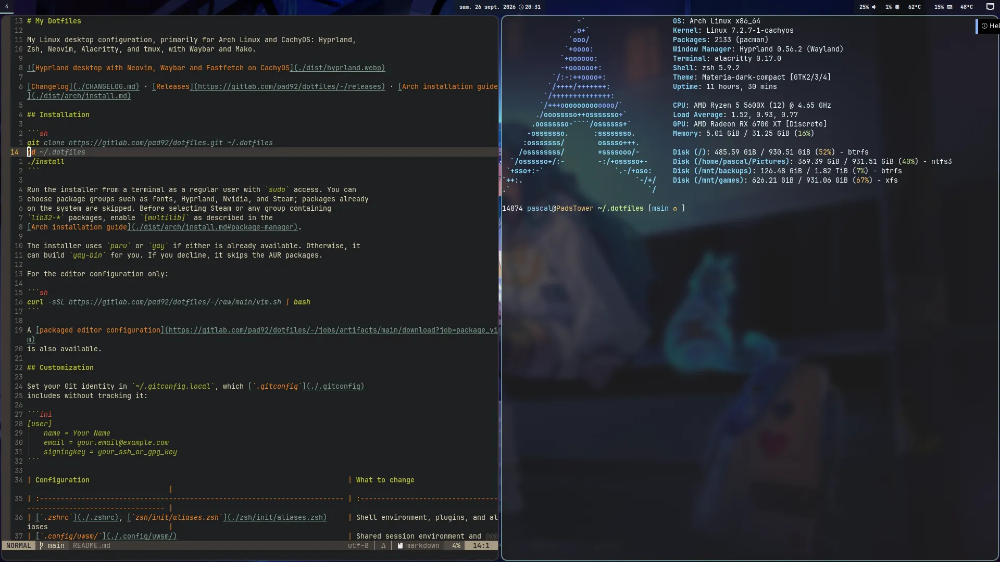

# My Dotfiles

My Linux desktop configuration, primarily for Arch Linux and CachyOS: Hyprland,
Zsh, Neovim, Alacritty, and tmux, with Waybar and Mako.



[Changelog](./CHANGELOG.md) · [Releases](https://gitlab.com/pad92/dotfiles/-/releases) · [Arch installation guide](./dist/arch/install.md)

## Installation

```sh
git clone https://gitlab.com/pad92/dotfiles.git ~/.dotfiles
cd ~/.dotfiles
./install
```

Run the installer from a terminal as a regular user with `sudo` access. You can
choose package groups such as fonts, Hyprland, Nvidia, and Steam; packages already
on the system are skipped. Before selecting Steam or any group containing
`lib32-*` packages, enable `[multilib]` as described in the
[Arch installation guide](./dist/arch/install.md#package-manager).

The installer uses `paru` or `yay` if either is already available. Otherwise, it
can build `yay-bin` for you. If you decline, it skips the AUR packages.

For the editor configuration only:

```sh
curl -sSL https://gitlab.com/pad92/dotfiles/-/raw/main/vim.sh | bash
```

A [packaged editor configuration](https://gitlab.com/pad92/dotfiles/-/jobs/artifacts/main/download?job=package_vim)
is also available.

## Customization

Set your Git identity in `~/.gitconfig.local`, which [`.gitconfig`](./.gitconfig)
includes without tracking it:

```ini
[user]
    name = Your Name
    email = your.email@example.com
    signingkey = your_ssh_or_gpg_key
```

| Configuration                                                              | What to change                                                      |
| :------------------------------------------------------------------------- | :------------------------------------------------------------------ |
| [`.zshrc`](./.zshrc), [`zsh/init/aliases.zsh`](./zsh/init/aliases.zsh)     | Shell environment, plugins, and aliases                             |
| [`.config/uwsm/`](./.config/uwsm/)                                         | Shared session environment and compositor-specific GPU settings     |
| [`.config/hypr/`](./.config/hypr/)                                         | Bindings, window rules, and `hosts/<hostname>.lua` hardware layouts |
| [`hyprtoolkit.conf`](./.config/hypr/hyprtoolkit.conf)                      | Toolkit colors, fonts, GTK/icon themes, and geometry                |
| [`.config/waybar/`](./.config/waybar/)                                     | Status bar, including per-host configurations                       |
| [`.config/alacritty/`](./.config/alacritty/), [`.tmux.conf`](./.tmux.conf) | Terminal appearance and tmux bindings                               |
| [`.config/nvim/`](./.config/nvim/), [`.vimrc`](./.vimrc)                   | Editor settings and plugins                                         |
| `~/.local/share/backgrounds/`                                              | Images for wallpaper rotation                                       |

Shell settings include `LANG`, `EDITOR`, and the Oh My Zsh plugin list. The common
UWSM environment defines `BROWSER`, `TERMINAL`, and `XCURSOR_THEME`, while
`env-hyprland` contains host-specific GPU settings such as `AQ_DRM_DEVICES` and
Vulkan drivers. Hyprland host files define
monitor layouts and workspace mappings; Waybar uses `config.PadsTower` and
`config.PadsP5560` for different hardware.

Alacritty settings cover fonts, spacing, opacity, and colors. For Hyprland Lua
validation and completion, see `.config/hypr/.luarc.json`. Electron 38 and later
select native Wayland automatically in a Wayland session, without an environment
variable; `~/.config/electron-flags.conf` remains available for editor-specific flags.

## Shell and editors

Zsh uses Oh My Zsh with `docker`, `ansible`, `git`, `vscode`, and `thefuck`, plus
autosuggestions and syntax highlighting. It also configures history, prompt
themes, and `$HOME/.bin` in `PATH`.

### Custom aliases and functions

Aliases live in [`zsh/init/aliases.zsh`](./zsh/init/aliases.zsh), and shell
functions load from [`zsh/functions/`](./zsh/functions/).

| Alias                            | Command                                 |
| :------------------------------- | :-------------------------------------- |
| `terraform`                      | `tofu`, when available                  |
| `mediasync`                      | Home media server sync script           |
| `backup`                         | `~/.dotfiles/bin/backup.sh`             |
| `steam-opt`                      | `steam-optimize`                        |
| `mirrored`, `mirrors`, `mirrora` | `mirror` sorted by delay, score, or age |

Common functions:

| Command                                      | Purpose                                                                                  |
| :------------------------------------------- | :--------------------------------------------------------------------------------------- |
| `arch_update`                                | Run `yay -Syu --devel`, firmware checks, Flatpak updates, and orphan/cache cleanup       |
| `clean_arch`                                 | Remove orphan packages, clean pacman/yay caches, and find `.pacnew` / `.pacsave` files   |
| `mirror [delay\|score\|age]`                 | Select and rank French Arch mirrors with `reflector`                                     |
| `extract <file>`                             | Unpack archives including `.tar.bz2`, `.tgz`, `.zip`, `.rar`, and `.7z`                  |
| `gpg-encrypt <file/dir>` / `gpge`            | Encrypt files or directories recursively; prompt for the GPG email                       |
| `gpg-decrypt <file/dir>` / `gpgd`            | Decrypt files or directories and extract `.tar.gz.gpg` / `.tgz.gpg` archives             |
| `md5`, `sha1`, `sha256`, `sha512` `<string>` | Hash a string with OpenSSL                                                               |
| `ssh-copy-agent-keys [user@host]`            | Select keys from `ssh-agent` and add them to remote `authorized_keys` without duplicates |
| `ip_a`, `ip_l`, `ip_p`                       | Show all, local, or public IP information                                                |
| `curl_time <url>`                            | Measure DNS, connection, first-byte, and total HTTP timings                              |
| `meteo`                                      | Show the weather through `wttr.in`                                                       |
| `transfer <file>`                            | Upload to `transfer.sh` and return a shareable URL                                       |
| `youtubeEncode <file>`                       | Encode video with `libx264` and AAC for YouTube                                          |
| `radio`                                      | Listen to radio from the terminal                                                        |
| `calc "<expr>"`                              | Evaluate expressions with `bc`                                                           |
| `src`                                        | Reload the shell configuration                                                           |

Maintenance functions live in `arch.zsh`; archive and encryption helpers live
in `archive.zsh` and `crypt.zsh`. The GPG helpers preserve modification times
and offer to delete source files. Encryption uses `--trust-model always`;
decryption also restores timestamps when extracting archives.

### Shell shortcuts

Configured in [`zsh/init/key-bindings.zsh`](./zsh/init/key-bindings.zsh):

| Shortcut               | Action                               |
| :--------------------- | :----------------------------------- |
| `Ctrl+R`               | Search backward through history      |
| `Ctrl+X Ctrl+E`        | Edit the command in `$EDITOR`        |
| `Ctrl+Left/Right`      | Move by word                         |
| `Alt+L` (`Esc L`)      | Run `ls`                             |
| `Alt+W` (`Esc W`)      | Cut text between the cursor and mark |
| `Alt+M`                | Copy the previous shell word         |
| `Up/Down` after typing | Search history by the typed prefix   |
| `PageUp/PageDown`      | Navigate history                     |
| `Home/End`             | Move to the start/end of the line    |
| `Shift+Tab`            | Cycle completion backward            |
| `Space`                | Expand history references            |

### Follow several logs

[`mtail`](./zsh/functions/mtail.zsh) prefixes lines with the filename and uses
`tail -F` to follow files across rotation. It prints the last 10 lines and scans
for new matches every second. Quote globs to include future files:

```zsh
mtail                              # Defaults to *.log
mtail app.log worker.log           # Specific files
mtail '*.log' '/var/log/app/*.log'  # Current and future matches
mtail 'my app.log'                 # Spaces in filenames
```

`Ctrl+C` stops the followers without closing Zsh. Requires `awk` and standard
command-line tools, not `inotify-tools`.

### Editors

[Neovim](./.config/nvim/) is configured in Lua:

- `lazy.nvim` manages plugins and lazy loading.
- Telescope searches files, buffers, and symbols.
- `nvim-treesitter` on its `main` branch provides highlighting, indentation,
  and folding. This setup requires Neovim 0.12+.
- Native LSP (`vim.lsp.config` / `vim.lsp.enable`, available since 0.11) works
  with Mason and `nvim-cmp`. `LspAttach` sets navigation, diagnostic, and
  formatting shortcuts.
- Gitsigns shows changes in the margin and provides hunk navigation, staging,
  and blame commands.
- Gruvbox, Lualine, and vertical indentation guides define the appearance.

The [older Vim setup](./.vimrc) uses Vundle, a custom status line, filetype
settings, `vim-gitgutter`, and `vim-fugitive`. Alacritty is the terminal;
tmux includes session-management and layout-persistence plugins.

## Desktop

The Hyprland configuration uses Lua and requires **Hyprland 0.55+**.
The theme starts in [`hyprtoolkit.conf`](./.config/hypr/hyprtoolkit.conf).
`include/toolkit.lua` parses it, `config.lua` consumes it, and
`conf/autostart.lua` applies GTK/libadwaita settings through `gsettings`.
Lock-screen colors remain separate, as described below.

For TTY startup, see the
[session installation guide](./dist/arch/install.md#gnome-keyring-pam-setup).
It covers GNOME Keyring PAM configuration in `/etc/pam.d/login`, UWSM setup,
Zsh startup files, and systemd session services. The
[upstream systemd guide](https://wiki.hypr.land/Useful-Utilities/Systemd-start/)
provides further context.

### Main shortcuts

| Shortcut                                  | Action                                         |
| :---------------------------------------- | :--------------------------------------------- |
| `SUPER + Return`                          | Terminal                                       |
| `SUPER + E / C / W / M`                   | File manager / editor / browser / music player |
| `SUPER + Shift + Return`                  | Password manager                               |
| `SUPER + Shift + Q`                       | Close window                                   |
| `SUPER + [0-9]` / `SUPER + Shift + [0-9]` | Focus workspace / move window to workspace     |
| `SUPER + Arrows` or Vim keys              | Move focus; add `Shift` to move the window     |
| `SUPER + F` / `SUPER + ALT + Space`       | Toggle fullscreen / floating                   |
| `SUPER + L` / `SUPER + Delete`            | Lock / logout menu                             |
| `SUPER + ALT + Right`                     | Change wallpaper                               |
| `SUPER + PgUp/PgDn` / `SUPER + Home`      | Zoom in/out / reset                            |
| `Print` / `SUPER + P`                     | Screenshot                                     |

Media and brightness keys control volume, playback, and screen brightness.
Left-click Waybar's audio module to switch to the next output sink. Right-click it
to open `pavucontrol`.

### Wallpapers and lock screen

Put wallpaper images in `~/.local/share/backgrounds/`. For example, to copy
images tagged `paysage` from a source directory:

```sh
exiftool -q -if '$Keywords =~ /paysage/' -r ${SRC_DIR} -o "${XDG_DATA_HOME}/backgrounds/"
```

`awww.service` only starts in a Hyprland session. It waits for the Wayland socket,
removes stale sockets, and runs the daemon with `--no-cache`. These checks prevent
the startup races and cache failures seen on this setup. Every 30 minutes,
`awww_random.timer` calls `awww_random.service`, which uses
[`awww.sh`](./bin/awww.sh) to choose a wallpaper for each monitor. To change them
manually:

```sh
systemctl --user start awww_random.service
```

[Hyprlock](./.config/hypr/hyprlock.conf) shows the clock, system batteries, and
media information. Player labels refresh every second, batteries every 10
seconds, and artwork every 5 seconds. Its [scripts](./.config/hypr/hyprlock/)
use `playerctl` for metadata, `curl` for remote covers, and ImageMagick (`magick`
or `convert`) to produce 150 × 150 PNGs. The first cover appears after a refresh
and any download time. Missing artwork displays a transparent image.

Covers are cached by URL under `$XDG_RUNTIME_DIR`, falling back to a private
directory under `${TMPDIR:-/tmp}`. Battery readings come from
`/sys/class/power_supply` and exclude peripherals. Lock-screen colors and
positions are configured separately in `hyprlock.conf`.

## Scripts

See [`bin/`](./bin/) for the full collection.

| Script                                                     | Purpose                                                                                                                                |
| :--------------------------------------------------------- | :------------------------------------------------------------------------------------------------------------------------------------- |
| [`steam-optimize`](./bin/steam-optimize) (`steam-opt`)     | Python 3 game launcher with monitor detection, RADV/Vulkan ICD/Mesa layer settings, per-game overrides, Gamescope, and session cleanup |
| [`backup.sh`](./bin/backup.sh) (`backup`)                  | Back up with rsync and SSH agent authentication; [exclude patterns](./dist/backup_excludes.txt)                                        |
| [`awww.sh`](./bin/awww.sh)                                 | Select a distinct wallpaper per monitor with `shuf -z` and `mapfile`                                                                   |
| [`razer_dpi.py`](./bin/razer_dpi.py)                       | Manage Razer mouse DPI                                                                                                                 |
| [`hypr-screenshot.sh`](./bin/hypr-screenshot.sh)           | Capture the desktop showcase in a nested compositor with `make screenshot`                                                             |
| [`comcut`](./bin/comcut), [`comskip.sh`](./bin/comskip.sh) | Detect and remove commercial breaks with comskip/ffmpeg, adapted from [comchap](https://github.com/BrettSheleski/comchap)              |
| [`diff-cmd`](./bin/diff-cmd)                               | Compare a command's output for two arguments using the `IN` placeholder                                                                |
| [`vscodium_ext.sh`](./bin/vscodium_ext.sh)                 | Install VSCodium extensions                                                                                                            |

## CI and releases

The repository is mirrored on GitHub, GitLab, and a self-hosted Gitea instance.
All three use shared scripts in [`.ci_bin/`](./.ci_bin/).

| Forge  | Pipeline                                     | Documentation                                     |
| :----- | :------------------------------------------- | :------------------------------------------------ |
| GitHub | [`.github/workflows/`](./.github/workflows/) | [Workflows README](./.github/workflows/README.md) |
| GitLab | [`.gitlab-ci.yml`](./.gitlab-ci.yml)         | [GitLab CI README](./.gitlab/README.md)           |
| Gitea  | Reuses `.github/workflows/`                  | See the Workflows README                          |

[`.ci_bin/build_pages.sh`](./.ci_bin/build_pages.sh) builds the README,
changelog, installation guide, and CI documentation into a static site. It also
backs the local `post-commit` preview hook. The CI pages are published at
`/github/workflows/README.md/` and `/.gitlab/README.md/`; the GitHub path loses its
leading dot because `actions/upload-pages-artifact` strips `.github` from the
published archive.

Tags matching `v*` publish a release using the matching changelog section,
extracted by [`.ci_bin/extract_release_notes.sh`](./.ci_bin/extract_release_notes.sh).

## Application ecosystem

| Category              | Tools                      |
| :-------------------- | :------------------------- |
| Shell                 | Zsh                        |
| Editors               | Neovim, Vim, VSCode        |
| Terminal and sessions | Alacritty, tmux            |
| Desktop tools         | Waybar, hyprlauncher, Mako |
| Passwords             | Proton Pass CLI            |
| System information    | Fastfetch, Htop            |

_Maintained by [pad](https://gitlab.com/pad92)🐐 with ❤️ since 2015 (11+ years)_
